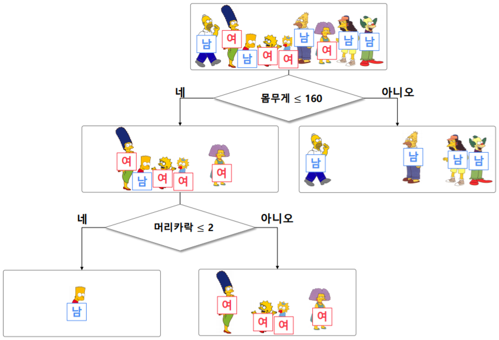
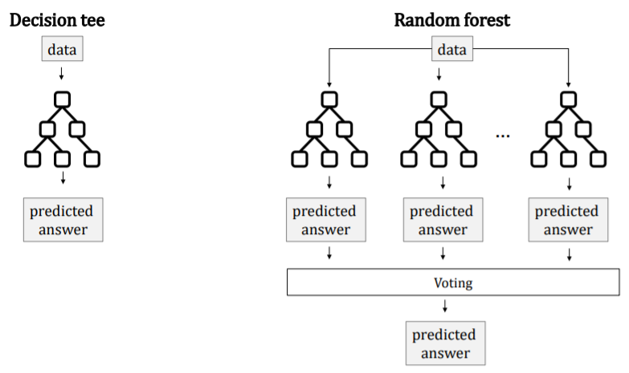
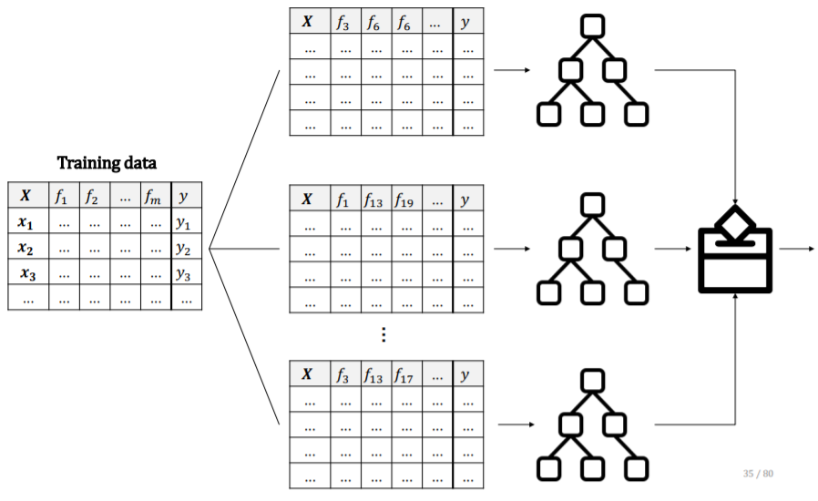

# Chapter1  
## 팀원 github hompage  
+ 강다빈  
  + [강다빈 깃 허브 사이트](https://dabin0513.github.io/)  
+ 백남규  
  + [백남규 깃 허브 사이트](https://parkiy76.github.io/opswtp/)  
+ 박예진  
  + [박예진 깃 허브 사이트](https://parkiy76.github.io/opswtp/)  
+ 서준철  
  + [서준철 깃 허브 사이트](https://seojuncheol1.github.io/)  
+ 조은채  
  + [조은채 깃 허브 사이트](https://joeunchae9835.github.io/)  

# Chapter2  
## Chapter2-1 : 컴퓨터 데이터 구조    
# Stack  
>+ FILO: First In Last Out  
>+ push: 새로운 요소 추가  
>+ pop: 가장 최근에 들어오는 것을 지우기    
>+ Stack의 활용 예시  
>  + 후위 표기법 계산  
>  + 수식의 괄호 검사(연산자 우선순위 표현을 위한 괄호 검사)  

  
+ Stack은 데이터의 삽입과 삭제가 한 방향에서만 이루어지는데 삽입과 삭제가 일어나는 위치를 top이라고 합니다.  

# Queue  
>+ FIFO: First In First Out  
>+ Enqueue: 가장 늦게 온 것은 가장 뒤에  
>+ Dequeue: 가장 앞에 있는 것을 가장 먼저 삭제  
>+ Queue의 활용 예시  
>  + 은행 업무  
>  + 콜센터 고객 대기시간  
>  + 프로세스 관리  
>  + 너비 우선 탐색(BFS, Breath-First Search)구현  

  
+ 출구를 머리(front)로 정해서 삭제를 수행하고, 입구는 꼬리(rear)로 정해서 삽입을 수행합니다.  
 
# 트리(Tree)
> + 트리는 노드로 이루어진 자료 구조를 말합니다.
>   + 트리는 하나의 루트 노드를 가집니다.
>   + 루트 노드는 0개 이상의 자식 노드를 갖고 있습니다.
>   + 그 자식 노드 또한 0개 이상의 자식노드를 가지고 있고, 이는 반복적으로 정의 됩니다.


# 트리와 관련된 용어
> - 루트 노드(root node): 부모가 없는 노드로 트리는 하나의 루트 노드만을 가짐
> - 단말 노드(leaf node): 자식이 없는 노드를 말합니다.
> - 내부 노드(internal node): 단말노드가 아닌 노드
> - 간선(edge): 노드를 연결하는 선
> - 형제(sibling): 같은 부모를 가진 노드
> - 노드의 사이즈(size): 자신을 포함한 모든 자손 노드의 개수
> - 노드의 깊이(depth): 루트에서 어떤 노드에 도달하기 위해 거쳐야 하는 간선의 수
> - 노드의 레벨(level): 트리의 특정 깊이를 가지는 노드의 집합
> - 노드의 차수(degree): 하위 트리 개수/ 간선수(degree): 각 노드가 지닌 가지의 수
> - 트리의 차수(degree of tree): 트리의 최대 차수
> - 트리의 높이(height): 루트 노드에서 가장 깊숙히 있는 노드의 깊이

-----
## Chapter2-2 : 데이터사이언스개론  
### 2-2-1 결정 트리(Decision tree)  
> - 데이터를 이용하여 이를 분류하거나 결과값을 예측하는 분석 방법  
> - 각 노드는 데이터를 가장 잘 구분할 수 있는 질문(기준)으로 데이터를 분류함  
> - 결정 트리는 정보 이득을 최대화하는 방향으로 학습이 진행됨  

> - 오버피팅(overfitting) : 주어진 학습 데이터를 과하게 학습하는 것으로 **결정 트리의 단점**   
>   - 학습 데이터에 대한 오차는 줄일 수 있어도, 실제 데이터의 오차가 증가하게 됨   
> - 엔트로피(Entropy) :불순도를 수치로 척도  
>   - 불순도(inpurity) : 해당 범주 안에 서로 다른 데이터가 얼마나 섞여 있는지를 뜻함  
>   - 엔트로피가 높으면 불순도가 높고, 엔트로피가 낮으면 불순도도 낮음
>   - 엔트로피가 1이면 불순도가 최대 -> 한 범주 안에 데이터가 정확히 반반 있음
> - 정보 이득(information gain) : 분기 이전의 엔트로피에서 분기 이후의 엔트로피를 뺀 수치  

- 예시 : 성별을 예측할 수 있는 분류 규칙(classification) 도출  
|*이름\특질* |**머리카락 길이**|**몸무게**|**나이**|**성별(부류 Class)**|
|:--------:|:---------------:|:--------:|:------:|:------------------:|
|**Homer** |0''              |250       |36      |남성                |
|**Marge** |10''             |150       |34      |여성                |
|**Bart**  |2''              |90        |10      |남성                |
|**Lisa**  |6''              |78        |8       |여성                |
|**Maggle**|4''              |20        |1       |여성                |
|**Abe**   |1''              |170       |70      |남성                |
|**Selma** |8''              |160       |41      |여성                |
|**Otto**  |10''             |180       |38      |남성                |
|**Krusty**|6''              |200       |45      |남성                |
    - 이름은 밑의 그림에 나와 있는 순서대로  

  

### 2-2-2 랜덤 포레스트(Random forest)   
> - 랜덤 포레스트를 배우기 위해서는 먼저 결정 트리를 알아야 함  
>   - 결정 트리가 모여서 랜덤 포레스트를 구성하기 때문에 - 숲(forest)과 나무(tree)의 관계  
> - 랜덤 포레스트를 구성하는 각 결정 트리의 예측값 중 가장 많이 나온 값을 최종 예측값으로 정함(다수결의 원칙을 따름)  



> - 랜덤 포레스트는 결정 트리의 단점인 오버피팅을 줄일 수 있음  
>   - 오버피팅된 결정 트리가 있더라도 서로 다른 방향으로 오버피팅되었다면 그 결과를 평균 냄으로써 오버피팅을 줄일 수 있음  
    - 결정 트리를 만들 데이터를 무작위로 뽑음 -> 오버피팅이 일어나게 하는 특이한 값을 골라낼 수 있음(높은 일반화 능력)  
>   - 결정 트리를 만들 데이터의 특질을 무작위로 뽑음 -> 결정 트리가 오버피팅된다면 다양한 방향으로 오버피팅됨(다양한 관점)  

- 아래와 같은 방식으로 동작함  


* 랜덤 포레스트에 대해 설명하는 유튜브 영상 : [How Random Forest algorithm works](https://www.youtube.com/watch?v=loNcrMjYh64)   

-----
## Chapter2-3 : 프로그래밍 응용 1
#### 자바란?

1. 완전한 객체지향 언어이며, 객체지향의 특성인 클래스, 상속, 캡슐화, 다형성 등의 개념이 적  용된 언어이다.  

#### 조건문  
- switch-case문
```java
switch(조건식){
	case: 조건1
    	break;
    case: 조건2
    	break;
    default:
```  

- if 문  
```java
if(조건삭){//조건식이 true일 때 아래 실행문 동작
	실행문;
    실행문;
 }
```  

#### 반복문  
- while문 
```java
while(조건식){}
```

- do-while문 
```java
 do {} while(조건식);
```

- for문 
```java
for(초기식; 조건식; 증감식){}
```

#### 예제 코드  
```java
import java.util.Scanner;
 
public class Gugudan 
{
    public static void main(String args[])
    {
        for( ; ; )    // 범위가 벗어났을경우 계속 입력하기위한 무한 반복문 사용        
        {
            System.out.print("1부터 9까지의 임의의 숫자를 입력하세요 : ");
            Scanner sDan = new Scanner(System.in);
            int dan = sDan.nextInt();
            
            if(dan < 10)    // 1 ~ 9까지 범위 일때
            {
                for(int su = 1 ; su < 10 ; su ++)    // 단이 정해지면 계산 및 출력하기위한 반복문
                {
                    System.out.println(dan + " * " + su + " = " + (dan * su) + " ");
                }
                break;    // 계산이 완료되면 STOP!
            }else
            { 
                System.out.println("1부터 9까지 다시 입력해주세요.");
                continue;    // 1 ~ 9 까지 범위안에 없을시 다시 for문 처음으로 돌아가기위해 continue 사용
            }
        }    
    }
}

```
- 구구단을 출력하는 코드


#### 용어정리  
1. 클래스 : 객체를 만들어 내기 위한 틀  
2. 객체 : 클래스를 통해 만들어진 구현물  
3. 메소드 : 특정 작업을 수행하기 위한 명령문의 집합  
4. 생성자 : 객체가 생성될 때 반드시 수행되어햐 하는 기능  

[TOC]
## Chapter2-4 : 소프트웨어 공학개론

## Chapter2-5 : 오픈소스 소프트웨어

### 리눅스란?

* 리눅스란 리누스 토르발스가 개발한 컴퓨터 운영 체제이다. 리눅스는 유닉스같은 컴퓨터 운영체제를 만들려고 했지만 개발방식이 닫힌 개발방식으로 만들어진 유닉스와는 달리 리눅스는 프리소프트웨어 정신을 이어받고, 오픈소스 소프트웨어 개발방식에 따라서 만들어졌다. 그 후 리눅스는 프리 소프트웨어와 오픈 소스 개발의 가장 유명한 표본이 되었다.  

### 리눅스의 기본 명령어

**Directories**
>+ pwd :현재 디렉터리 출력
>+ ls : 디렉터리 파일 목록 나열
>+ cd : 디렉터리를 이동
>+ mkdir : 디렉터리 생성
>+ rmdir : 디렉터리   

  

**Files**
>+ touch : 파일을 만든다. 만약에 기존 파일이 있으면 최종 수정 시간을 변경한다.
>+ cp : 파일이나 디렉터리를 복사한다.
>+ rm : 파일이나 디렉터리를 삭제한다.
>+ mv : 파일이나 디렉터리를 이동하거나 이름을 변경한다.
>+ cat : 여러 파일을 묶어서 그 내용을 화면에 출력한다.  

  

**Links**
>+ ln : 두 파일간의 링크를 만든다.
>+ find : 하위 디렉터리에서 파일을 찾는다
>+ locate : 파일 데이터베이스에서 파일을 찾는다.  


